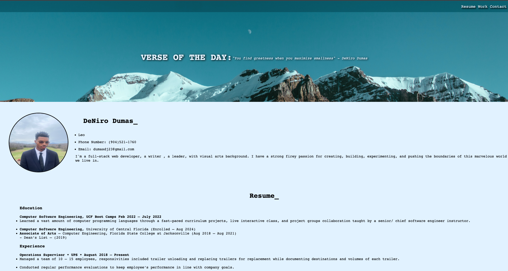

# Professional Portfolio

In this project, I implemented advanced css and the basic core skills of HTML I learned thus far, with media queries, flexbox, css varibles and more to build a responsive professional portfolio.

## Deployed Site
[Click Here](https://onlydeniros.github.io/pro-portfolio/)

## Screenshot of the deployed site

## Author
Sole Author: DeNiro Dumas

## Questions
Please visit my **[GitHub profile](https://github.com/onlydeniros)** to check out this and other projects I've created and contributed to.
If you have any specific questions about this project, please contact me at <dumasdj23@gmail.com>.